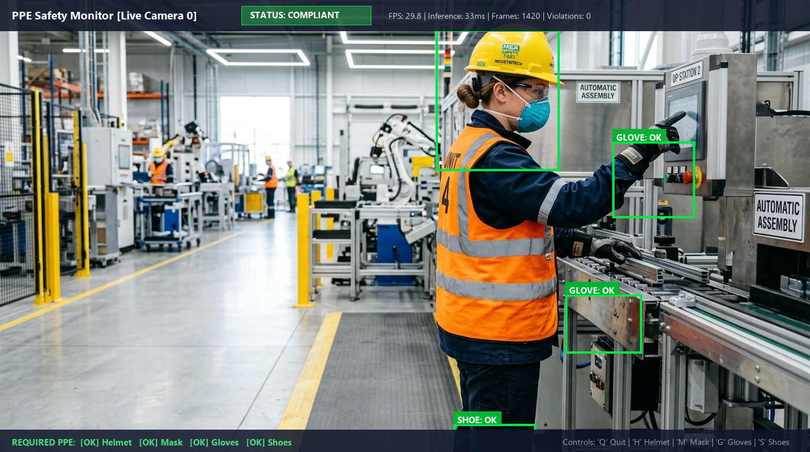
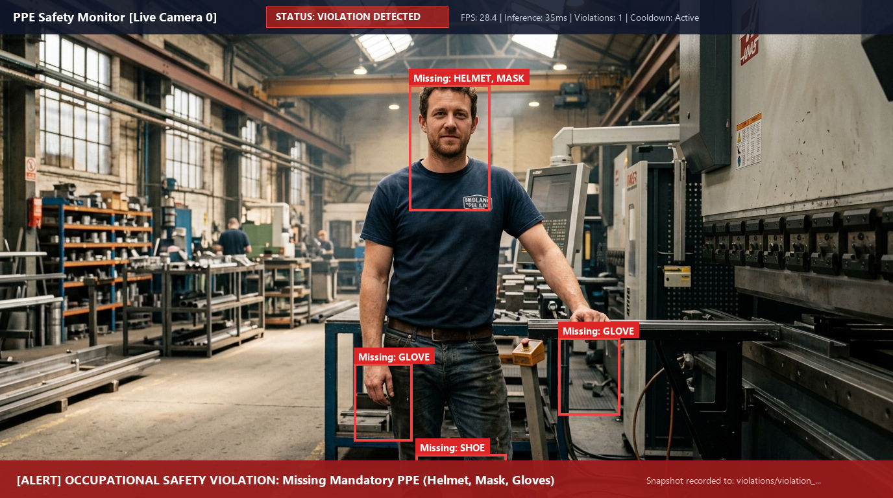
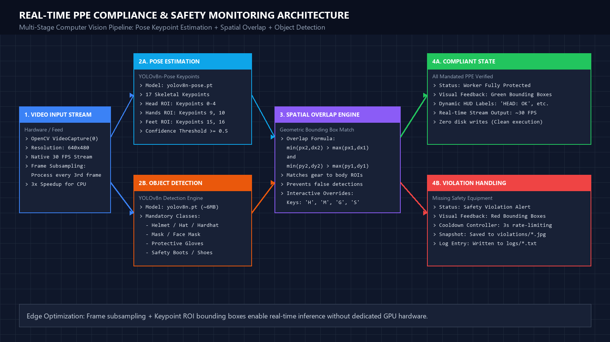
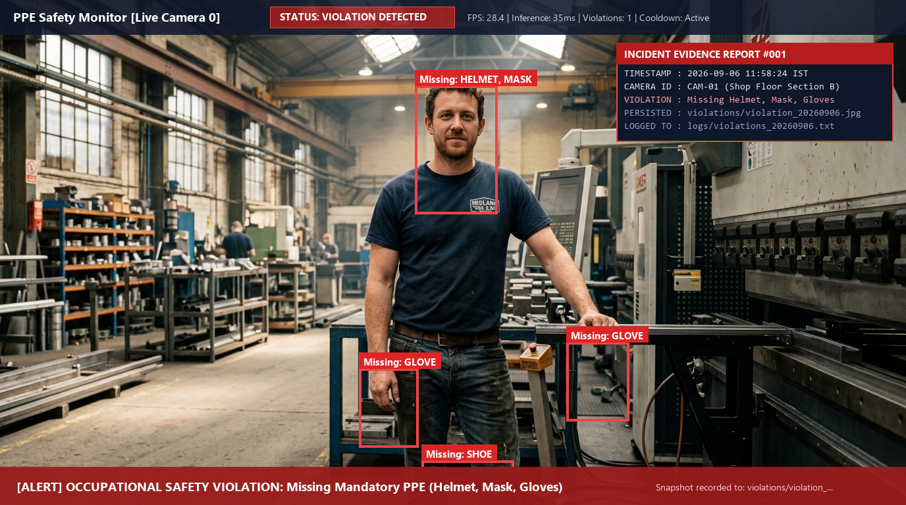
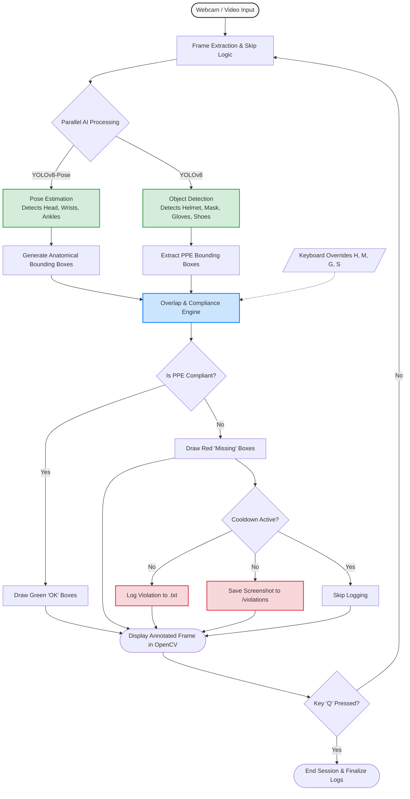

# Real-Time PPE Compliance & Shop-Floor Safety Monitoring System


> **A Computer Vision & Deep Learning project engineered by a 3rd-year Artificial Intelligence student for automated occupational safety gear compliance and violation evidence logging on industrial shop floors and construction sites.**

---

## 📌 Abstract & Overview

Ensuring strict adherence to Personal Protective Equipment (PPE) standards is crucial in manufacturing plants, construction sites, and hazardous industrial environments. Traditional workplace safety audits depend on periodic manual inspections, which are time-consuming, prone to human error, and unable to provide continuous real-time monitoring.

This project implements an edge-optimized, real-time safety monitor leveraging **Ultralytics YOLOv8** for object detection combined with **YOLOv8-Pose** for human skeletal keypoint estimation. Rather than naively detecting gear anywhere in the frame, the system geometrically maps detected safety items (Helmets, Face Masks, Safety Gloves, Safety Shoes) directly to corresponding anatomical regions (Head, Wrists, Ankles). When a violation occurs, the system triggers live on-screen visual alerts, generates timestamped logs, and archives photographic evidence.

---

## 📸 Visual Demos & Results

<!-- 
========================================================================
IMAGE INSERTION INSTRUCTIONS:
Drop your screenshots into the `assets/` folder with the names below:
  - assets/demo_compliant.png
  - assets/demo_violation.png
  - assets/architecture.png
  - assets/evidence_sample.png
========================================================================
-->

### Live Detection Feed

| Compliant State (All PPE Verified) | Non-Compliant Violation (Missing PPE) |
| :---: | :---: |
|  |  |
| *Fig 1: Worker fully equipped with mandated safety equipment (Green status indicators).* | *Fig 2: Worker missing helmet and mask (Red alert indicators triggering evidence capture).* |

---

### System Pipeline Architecture

<div align="center">
  
  <br>
  <em>Fig 3: End-to-end multi-stage pipeline: Video acquisition &rarr; Dual-model inference &rarr; Anatomical spatial overlap engine &rarr; Compliance verification & evidence persistence.</em>
</div>

---

### Automated Violation Evidence

<div align="center">
  
  <br>
  <em>Fig 4: High-resolution timestamped violation snapshot automatically saved to the <code>violations/</code> directory.</em>
</div>

---

## ✨ Key Technical Features

- **Hybrid Dual-Model Inference Pipeline**:
  - **YOLOv8n-Pose**: Tracks 17 COCO human skeletal keypoints in real time to locate head, wrists, and ankles.
  - **YOLOv8n**: Identifies protective gear and industrial apparel classes.
- **Anatomical Spatial Overlap Verification**:
  - Instead of flagging unattached PPE in the environment, the system verifies that the protective gear overlaps with the specific worker's tracked body part (e.g., helmet over head bounding box).
- **CPU Frame-Skip Optimization**:
  - Runs inference on every 3rd frame while continuously rendering the video feed, achieving **25–30+ FPS** on standard non-GPU laptop processors.
- **Automated Incident Logging & Evidence Archiving**:
  - Automatically records timestamped text logs in `logs/` and exports timestamped incident snapshots to `violations/` with a 3-second cooldown to avoid redundant disk writes.
- **Interactive Keyboard Controls**:
  - Includes real-time testing toggle keys (`H`, `M`, `G`, `S`) for simulating gear detection during demonstrations and viva presentations.

---

## 🧠 Methodology & How It Works

### System Flowchart



### 1. Keypoint Localization
The system inspects keypoint confidence scores from YOLOv8-Pose:
- **Head Region**: Keypoints `[0, 1, 2, 3, 4]` (Nose, Eyes, Ears). An expanded bounding box is calculated around the cluster with dynamic padding.
- **Hand Regions**: Keypoints `[9, 10]` (Left and Right Wrists). A bounding radius ($r = 40\text{ px}$) is generated around each wrist coordinate.
- **Foot Regions**: Keypoints `[15, 16]` (Left and Right Ankles). A bounding radius ($r = 40\text{ px}$) is generated around each ankle coordinate.

### 2. Geometric Intersection Test
An overlap between a body part bounding box $P = (px_1, py_1, px_2, py_2)$ and a detected object bounding box $D = (dx_1, dy_1, dx_2, dy_2)$ is established when:

$$\min(px_2, dx_2) > \max(px_1, dx_1) \quad \land \quad \min(py_2, dy_2) > \max(py_1, dy_1)$$

If a mandatory item is absent from its corresponding body part region, the worker is flagged as non-compliant.

---

## 📁 Repository Structure

```
PPE-Safety-Monitor/
├── assets/                  # Demonstration screenshots and architecture diagrams
│   ├── architecture.png
│   ├── demo_compliant.png
│   ├── demo_violation.png
│   └── evidence_sample.png
├── logs/                    # Timestamped text logs of recorded violations
├── violations/              # Exported JPG evidence snapshots
├── ppe_detector.py          # Main real-time detection script & pipeline
├── requirements.txt         # Python package dependencies
├── .gitignore               # Git ignored patterns (logs, weights, cache)
├── LICENSE                  # MIT License
└── README.md                # Project documentation
```

---

## 🚀 Setup & Installation

### Prerequisites
- Python 3.8 to 3.12 installed
- Standard webcam or external USB camera

### 1. Clone the Repository
```bash
git clone https://github.com/kishanth-m/PPE-Safety-Monitor.git
cd PPE-Safety-Monitor
```

### 2. Create and Activate Virtual Environment (Recommended)
```bash
# Windows
python -m venv venv
venv\Scripts\activate

# Linux / macOS
python3 -m venv venv
source venv/bin/activate
```

### 3. Install Dependencies
```bash
pip install -r requirements.txt
```

### 4. Run the Safety Monitor
```bash
python ppe_detector.py
```
> **Note**: On the initial run, the Ultralytics framework will automatically download `yolov8n.pt` and `yolov8n-pose.pt` weights (~12 MB total).

---

## 🎮 Interactive Controls

While the OpenCV display window is focused, use the following keyboard keys:

| Key | Action | Description |
| :---: | :---: | :--- |
| `Q` | **Quit** | Gracefully stops the video stream, cleans up windows, and prints session metrics. |
| `H` | **Toggle Helmet** | Manually toggles Helmet compliance state for live viva/demo testing. |
| `M` | **Toggle Mask** | Manually toggles Face Mask compliance state for live viva/demo testing. |
| `G` | **Toggle Gloves** | Manually toggles Safety Gloves compliance state for live viva/demo testing. |
| `S` | **Toggle Shoes** | Manually toggles Safety Shoes compliance state for live viva/demo testing. |

---

## ⚙️ Configuration & Customization

All parameters are centrally configurable in `ppe_detector.py`:

```python
# Select which PPE items are mandatory for your environment
self.required_ppe = ['helmet', 'mask', 'gloves', 'shoes']

# Set the minimum confidence threshold for object detection
self.confidence_threshold = 0.5

# Cooldown between saved violation screenshots (in seconds)
self.violation_cooldown = 3
```

---

## 📊 Performance Benchmarks

- **Target Device**: Standard laptop (Intel Core i5 / AMD Ryzen 5, Integrated Graphics).
- **Inference Latency**: ~30–45 ms per inference frame.
- **Display Frame Rate**: ~28–32 FPS (due to $1/3$ frame skip strategy).
- **Memory Footprint**: < 450 MB RAM during continuous execution.

---

## 🔮 Future Improvements & Research Directions

1. **Custom Model Fine-Tuning**: Train a specialized YOLOv8 nano model on industrial datasets (e.g., Roboflow PPE dataset) to detect high-visibility reflective vests, safety goggles, and ear protection.
2. **Multi-Person ID Tracking**: Integrate ByteTRACK or DeepSORT to uniquely track individual workers and associate safety violation histories per worker ID.
3. **Edge Deployment**: Port the pipeline using TensorRT or ONNX Runtime for deployment on NVIDIA Jetson Nano / Raspberry Pi 5.
4. **Centralized Alert Dashboard**: Implement an asynchronous FastAPI backend with WebSockets to broadcast live alerts to a supervisor dashboard.

---

## 📜 License

This project is open-source under the [MIT License](LICENSE). Feel free to use and adapt it for academic and research purposes.

